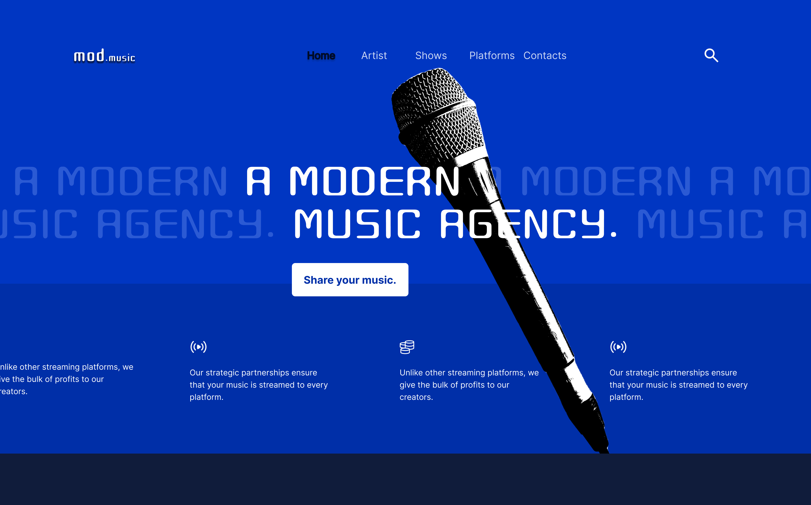

# My-UI-UX-Designs
A collection of UI/UX designs I've created using Figma. This portfolio showcases my skills in modern web design, component creation, and user interface design.

## 🚀 Featured Projects

### Project 1: Modern Navigation Bar

- **Tools:** Figma, Auto Layout, Components
- [View in Figma(https://www.figma.com/design/QwOAf0rBz4Yu59b93x4hcc/30-Days-UIUX-Challenge--Community-?node-id=2-520&m=dev&t=23fxcMK3vSIQBl3z-1)

### Project 1: Modern Hero Page

 
- **Tools:** Figma, Auto,Layout, Components
